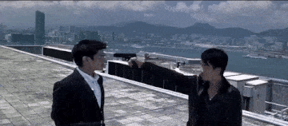
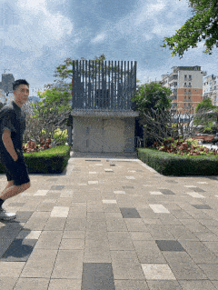
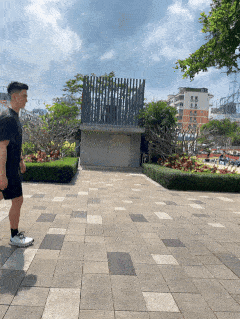
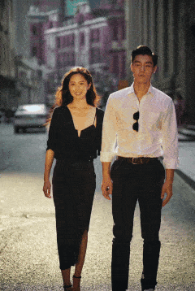
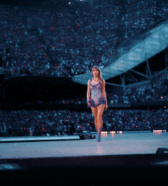

# RealisMotion: Decomposed Human Motion Control and Video Generation in the World Space


## 🔴Please go to [Project Page](https://anonymous.4open.science/w/RealisMotion-anonymous-3870/) for more than 100 videos examples. 
## 🔴$`\textcolor{red}{\text{Please refresh the project page if you meet 404 ERROR.}}`$ 
## 🔴You can also [download this repo](https://anonymous.4open.science/api/repo/RealisMotion-anonymous-3870/zip)  and click `index.html` if you meet network error.

Note that the GIFs shown here have some degree of visual quality degradation. 

<table class="center">
    <tr>
    <td colspan="2"></td>
    <td colspan="2"></td>
    </tr>
    <tr>
    <td></td>
    <td></td>
    <td></td>
    <td></td>
    </tr>
    <tr>
    <td></td>
    <td></td>
    <td></td>
    <td></td>
    </tr>
</table>


## Quick Start

### 1. Setup Repository and Environment

```bash
cd RealisMotion

conda create -n realismotion python=3.10
conda activate realismotion

pip install -r requirements.txt

# install FA3
git clone https://github.com/Dao-AILab/flash-attention.git
cd flash-attention
git checkout 0dfb28174333d9eefb7c1dd4292690a8458d1e89  # Important: using other FA3 might yield bad results on H20 GPUs
cd hopper
python setup.py install

cd ../../
```

### 2. Download Checkpoints

We provide two versions for inference: the first is the text-to-video (T2V) version (same as the model in the paper), the second is the image-to-video (I2V) version (to avoid duplicate work, we directly combine with the concurrent work [RealisDance-Dit](https://github.com/damo-cv/RealisDance)).

<table>
  <tr>
    <th>
      Version Type
    </th>
    <th>
      Advantage
    </th>
    <th>
      Disadvantage
    </th>
  </tr>
  <tr>
    <td>
      Text-to-Video (T2V) version
    </td>
    <td>
    <ul>
    <li>support fully decomposed subject and background control</li>
    <li>support dynamic background (video-to-video)</li>
    <li>support exact and accurate motion control</li>
    </ul>
    </td>
    <td>
    <ul>
    <li>might generate videos with unnatural details</li>
    <li>might meet foreground-background lighting inconsistency</li>
    </ul>
    </td>
  </tr>
  <tr>
    <td>
      Image-to-Video (I2V) version
    </td>
    <td>
    <ul>
    <li>similar ability as the I2V base model to preserve video details and consistent lighting</li></ul>
    </td>
    <td>
    <ul>
    <li>subject and background are defined within a single image (inseparable)</li>
    <li>might control the wrong human or generate unexpected motions</li>
    </ul>
    </td>
  </tr>
</table>

Please download the checkpoints as below. Use `HF_ENDPOINT=https://hf-mirror.com huggingface-cli xxxx` if you need to speed up downloading.

<table>
  <tr>
    <th>
      Version Type
    </th>
    <th>
      Bash Command
    </th>
  </tr>
  <tr>
    <td>
      T2V
    </td>
    <td>
      <pre>
<code>huggingface-cli download --resume-download xxx/RealisMotion --local-dir pretrained_models/RealisMotion</code>
      </pre>
    </td>
  </tr>
  <tr>
    <td>
      I2V
    </td>
    <td>
      <pre>
<code>huggingface-cli download --resume-download xxx/RealisDance-DiT --local-dir pretrained_models/RealisDance-DiT</code>
      </pre>
    </td>
  </tr>
</table>


### 3. Quick Inference

- Inference with Single GPU

<table>
  <tr>
    <th>
      Version Type
    </th>
    <th>
      Bash Command
    </th>
  </tr>
  <tr>
    <td>
      T2V
    </td>
    <td>
      <pre>
<code>CUDA_VISIBLE_DEVICES=0 python inference_t2v.py \
    --ref_path input/demo/InfernalAffairs/0_input_video.mp4 \
    --ref_cs_map_path input/demo/InfernalAffairs/cs_map.mp4 \
    --ref_mask_path input/demo/InfernalAffairs/mask.mp4 \
    --background_path input/demo/InfernalAffairs/0_input_video.mp4 \
    --background_mask_path input/demo/InfernalAffairs/mask.mp4 \
    --motion_folder input/demo/InfernalAffairs_falldown3_InfernalAffairs \
    --ref_index 0 \
    --background_start_index 0 \
    --background_num_frames 97 \
    --motion_start_index 0 \
    --motion_num_frames 97 \
    --prompt "A tense scene on a rooftop with a view of a bustling city and harbor, showcasing dramatic cityscape under a cloudy sky. Two figures are centered in the composition, one dressed in a dark outfit, extending their arm with a gun pointed at another figure wearing a navy suit. The urban backdrop features high-rise buildings and mountains in the distance, suggesting a metropolitan setting with a blend of natural elements." \
    --save-dir ./outputs</code>
      </pre>
    </td>
  </tr>
  <tr>
    <td>
      I2V
    </td>
    <td>
      <pre>
<code>python inference_i2v.py \
    --ref inputs/example_video/justin.png \
    --smpl inputs/demo/justin_tstageboy_justin/cs_map.mp4 \
    --hamer inputs/demo/justin_tstageboy_justin/hamer.mp4 \
    --prompt "Justin Bieber is walking along a rustic, dirt path in a rural landscape under an overcast sky, creating a moody and atmospheric scene. They are dressed in a roomy pink hoodie layered over a dark jacket, coupled with a long, flowing gray skirt that adds an eclectic touch to their ensemble. The outfit is completed with chunky black boots, providing contrast and robustness. The background features sparse buildings and expanses of dry grass, suggesting an isolated countryside setting, while the attire reflects a unique blend of casual and avant-garde fashion." \
    --save-dir ./outputs</code>
      </pre>
    </td>
  </tr>
</table>

Note: add `--enable-teacache` to inference with TeaCache for acceleration (optional, may cause quality degradation); add `--save-gpu-memory` to inference with small GPU memory (optional, will be super slow. Can be used with TeaCache).


- Inference with multi GPUs (Optional. Can be used with TeaCache)

<table>
  <tr>
    <th>
      Version Type
    </th>
    <th>
      Bash Command
    </th>
  </tr>
  <tr>
    <td>
      T2V
    </td>
    <td>
      <pre>
<code>CUDA_VISIBLE_DEVICES=0,1,2,3,4,5,6,7 torchrun --nproc_per_node=8 inference_t2v.py \
    --ref_path input/demo/InfernalAffairs/0_input_video.mp4 \
    --ref_cs_map_path input/demo/InfernalAffairs/cs_map.mp4 \
    --ref_mask_path input/demo/InfernalAffairs/mask.mp4 \
    --background_path input/demo/InfernalAffairs/0_input_video.mp4 \
    --background_mask_path input/demo/InfernalAffairs/mask.mp4 \
    --motion_folder input/demo/InfernalAffairs_falldown3_InfernalAffairs \
    --ref_index 0 \
    --background_start_index 0 \
    --background_num_frames 97 \
    --motion_start_index 0 \
    --motion_num_frames 97 \
    --prompt "A tense scene on a rooftop with a view of a bustling city and harbor, showcasing dramatic cityscape under a cloudy sky. Two figures are centered in the composition, one dressed in a dark outfit, extending their arm with a gun pointed at another figure wearing a navy suit. The urban backdrop features high-rise buildings and mountains in the distance, suggesting a metropolitan setting with a blend of natural elements." \
    --save-dir ./outputs \
    --multi-gpu</code>
    </pre>
    </td>
  </tr>
  <tr>
    <td>
      I2V
    </td>
    <td>
      <pre>
<code>CUDA_VISIBLE_DEVICES=0,1,2,3,4,5,6,7 torchrun --nproc_per_node=8 inference_i2v.py \
    --ref inputs/example_video/justin.png \
    --smpl inputs/demo/justin_tstageboy_justin/cs_map.mp4 \
    --hamer inputs/demo/justin_tstageboy_justin/hamer.mp4 \
    --prompt "Justin Bieber is walking along a rustic, dirt path in a rural landscape under an overcast sky, creating a moody and atmospheric scene. They are dressed in a roomy pink hoodie layered over a dark jacket, coupled with a long, flowing gray skirt that adds an eclectic touch to their ensemble. The outfit is completed with chunky black boots, providing contrast and robustness. The background features sparse buildings and expanses of dry grass, suggesting an isolated countryside setting, while the attire reflects a unique blend of casual and avant-garde fashion." \
    --save-dir ./outputs \
    --multi-gpu</code>
      </pre>
    </td>
  </tr>
</table>


### 4. Custom Batch Inference

<table>
  <tr>
    <th>
      Version Type
    </th>
    <th>
      Bash Command
    </th>
  </tr>
  <tr>
    <td>
      T2V
    </td>
    <td>
      <pre>
<code>CUDA_VISIBLE_DEVICES=0,1,2,3,4,5,6,7 torchrun --nproc_per_node=8 inference_t2v.py \
    --motion_num_frames 97 \
    --jsonl_path inputs/Trajectory100/meta.jsonl \
    --save-dir ./outputs \
    --multi-gpu</code>
   </pre>
    </td>
  </tr>
  <tr>
    <td>
      I2V
    </td>
    <td>
      <pre>
<code>CUDA_VISIBLE_DEVICES=0,1,2,3,4,5,6,7 torchrun --nproc_per_node=8 inference_i2v.py \
    --root YOUR_ROOT_PATH \
    --save-dir ./outputs \
    --multi-gpu</code>
  </pre>
  The YOUR_ROOT_PATH dir should be structured as: 
  <pre><code>root/
|---ref/
    |---1.png
    |---2.png
    |---...
|---smpl/
    |---1.mp4
    |---2.mp4
    |---...
|---hamer/
    |---1.mp4
    |---2.mp4
    |---...
|---prompt/
    |---1.txt
    |---2.txt
    |---... </code></pre>
    </td>
  </tr>
</table>


### 5. Motion Editing and Guidance Condition Rendering
To edit the trajectory, orientation and action of human, please follow followng steps.


#### 1. Setup Environment
First, please install GVHMR and DPVO following [install GVHMR](https://github.com/zju3dv/GVHMR/blob/main/docs/INSTALL.md). The `nvcc` in `third-party/DPVO/setup.py` should be modified as `['-O3', '-gencode', 'arch=compute_90,code=sm_90']` for H20 GPUs. Please symlink the checkpoints by `ln -s YOUR_PATH/GVHMR/inputs/checkpoints inputs/checkpoints`.


Then, please install DepthPro for focal length calibration as follows (optional). 
```
git clone https://github.com/apple/ml-depth-pro
cd ml-depth-pro
pip install .
source get_pretrained_models.sh 
cd ..
```

##### 2. SMPL-X Estimation 
We first estimate the SMPL-X for the input foreground subject, background and motion videos / images.


```
cd RealisMotion
export PYTHONPATH="YOUR_PATH/GVHMR/hmr4d:$PYTHONPATH"

# process foreground and background
python hmc/render_demo.py --video=inputs/example_video/internalaffairs.mp4 --output_root inputs/demo --track_id 1 

# process motion
python hmc/render_demo.py --video=inputs/example_video/falldown.mp4 --output_root inputs/demo 

```
By default, `--track_id` is set as 0 to track the first person. Use `-s` for static background. When you only have an image, turn it to a video first as below.
```
ffmpeg -loop 1 -i inputs/example_video/YOUR_IMAGE.jpg -c:v libx264 -preset veryslow -crf 0 -t 1 -pix_fmt yuv420p -vf "fps=25,scale=trunc(iw/2)*2:trunc(ih/2)*2" inputs/example_video/YOUR_VIDEO.mp4 -y
```

##### 3. Motion/Background/Subject Editing
To edit the motion, you need to specify the background path, the motion path, and the reference foreground path. We currently provide four examples for different usecases.

```
export PYTHONPATH="YOUR_PATH/GVHMR/hmr4d:$PYTHONPATH"

# example 1: affine transformation
python hmc/realismotion_render_demo.py \
    --video=inputs/example_video/internalaffairs.mp4 \
    --motion_path inputs/motion_bank/falldown  \
    --reference_path inputs/demo/internalaffairs  \
    --output_root inputs/demo \
    --window_size 1 \
    --repeat_smpl 0 50 1 \
    --pause_at_begin 50 \
    --pause_at_end 105 \
    --edit_type affine_transform\
    --affine_transform_args 0 0 0 -0.3

# example 2: move according to any trajectory
python hmc/realismotion_render_demo.py \
    --video=inputs/example_video/justin.mp4 \
    --motion_path inputs/motion_bank/tstageboy  \
    --reference_path inputs/demo/justin  \
    --output_root inputs/demo \
    --window_size 25 \
    --repeat_smpl 18 51 8 \
    --edit_type edit_trajectory \
    --edit_trajectory_args 815 500  952 1050  1192 502 \
    -s

  python hmc/realismotion_render_demo.py \
    --video=inputs/example_video/male.mp4 \
    --motion_path inputs/motion_bank/tstageboy  \
    --reference_path inputs/demo/male  \
    --output_root inputs/demo \
    --window_size 25 \
    --repeat_smpl 18 51 12 \
    --edit_type edit_trajectory \
    --edit_trajectory_args 1107 48 1098 662 1347 486 1154 303 952 682 1136 832 1100 494 910 787 \
    --append circle \
    -s

# example 3: move according to a heart-shape trajectory
python hmc/realismotion_render_demo.py \
    --video=inputs/example_video/male.mp4 \
    --motion_path inputs/motion_bank/tstageboy  \
    --reference_path inputs/demo/male  \
    --output_root inputs/demo \
    --window_size 25 \
    --repeat_smpl 18 51 12 \
    --edit_type edit_trajectory_as_heart \
    --edit_trajectory_as_heart_args 1 2 \
    --append heart \
    -s


# example 4: off-the-ground kickoff demo
python hmc/realismotion_render_demo.py \
    --video=inputs/example_video/male.mp4 \
    --motion_path inputs/demo/male  \
    --reference_path inputs/demo/male  \
    --output_root inputs/demo \
    --window_size 25 \
    --pause_at_begin 200 \
    --edit_type edit_trajectory_kickoff \
    --edit_trajectory_kickoff_args 546 515 277 510 186 752 311 929 282 601 45 687  \
    --speed_ratio 20 \
    --append kickoff \
    -s
```

More examples could be found at [inputs/README.md](inputs/README.md). As for kid, add `--kid 1.0`. One can use a float number between 0 and 1 to interpolate between adult and kid.

The human mask and hamer (hand pose) are optional, but providing them could improve the video quality. To obtain the human mask, one can install [MatAnyone](https://github.com/pq-yang/MatAnyone?tab=readme-ov-file#-installation) locally or use this [MatAnyone Online Demo](https://huggingface.co/spaces/PeiqingYang/MatAnyone). Without the human mask, we will extract one from the SMPL-X depth. To obtain the hamer, please refer to [Hamer Preparation](third_party/GVHMR/tools/demo/hamer/README.md). Without hamer, we will use the standard hand pose in SMPL-X.


## Disclaimer
This project is released for academic use.
We disclaim responsibility for user-generated content.


## Acknowledgement
We thank the authors of WHAM, 4D-Humans, and ViTPose-Pytorch for their great works, without which our project/code would not be possible.
